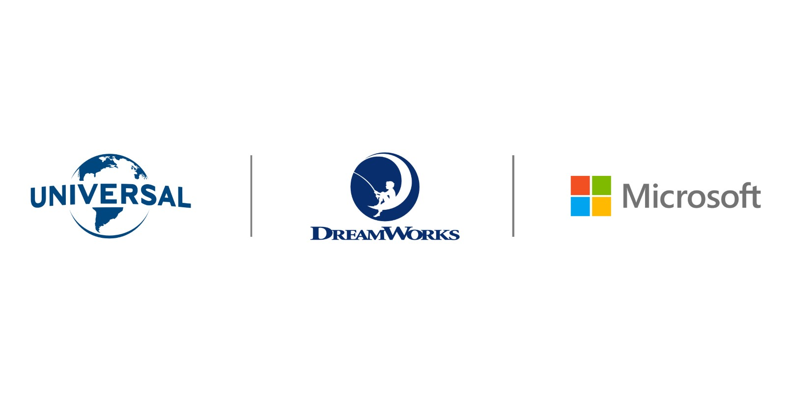
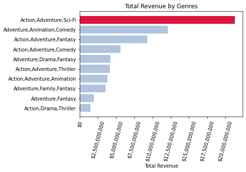
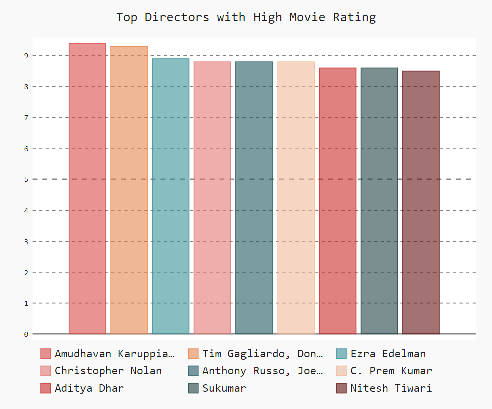
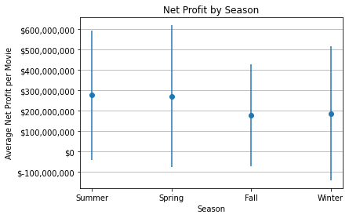

# Microsoft Movie Business Analysis

**Author**: [Ramil Chaimongkolbutr](mailto:ramil.ming@flatironschool.com)

## Overview

We conduct this analysis to provide useful recommendations for Microsoft to get a strong first step into a movie business. By analyzing movie data from multiple movie databases, we find 3 key components:
- Movie Genre
- Movie Director
- Movie Release

These components are crucial to help Microsoft start off the business successfully and be able to compete with those big names that have established themselves in the business for years.

## Business Problem

When we try to enter any new business, sometimes we find ourselves overwhelmed with too many choices we have to make or too much new information we have to learn. We often ask ourselves: where to begin?; who to bigin with?; and when?
This analysis will help us make these decisions easier and more effective.

## Data

Data comes from various movie database:
- IMDB over 70000 movies
- Box Office Moja around 3000 moives
- The Numbers over 5000 movies

## Results

1. **Our recommended Genre**
As we can see, movies nowadays are in multiple genres--they are not limited to a certain type. When we analyze the Top 100 highest gross movies, 23 of them are in the genre of *Action/Adventure/Sci-fi*.
In this particular genre, they have created over 21 billion dollars in the past 20 years. We find that it is a good idea that Microsoft should start with this specific genre.



2. **Our recommended Director** 
The movie should be directed by Christopher Nolan or Russo Brothers. Although these two are not in the top 3 of directors who have a highest movie rating, the movies that they made are in the genre that we recommended earlier.



3. **Our recommended Season** 
We  have found that the movie should be released in *Summer* because movies that are released in this season have the hightest average net profit of approximately 277 million dollars.



## Conclusions

We recommendthat Microsoft should start a movie business by aiming to create a movie in *Action/Adventure/Sci-fi* genre. The movie should be directed by either of these two talented directors: *Christopher Nolan* and *Russo Brothers*. And finally we believe that the movie will be successful when it is released *Summer*. 

## Next Steps

Further analysis could potentially yield a better recommendation to Microsoft:
- The optimized production budget for the movie.
- Prediction of competitor new-coming movies within a certain period of time.
 
## For More Information
See full analysis in [Jupyter Notebook](./aproject_one_code.ipynb) or check out this [presentation](./project_one_presentation.pdf). 
For additional info, contact Ramil Chaimongkolbutr at [ramil.ming@flatironschool.com](mailto:ramil.ming@flatironschool.com)


## Repository Structure

```
├── zippedData
├── images
├── README.md
├── project_one_presentation.pdf
└── project_one_code.ipynb
```