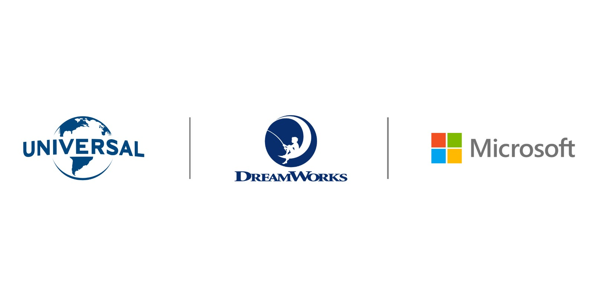
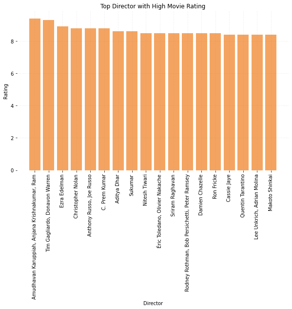
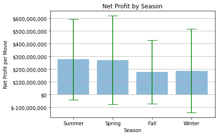

# Microsoft Movie Business Analysis

**Author**: [Ramil Chaimongkolbutr](mailto:ramil.ming@flatironschool.com)

## Overview

For this project, we use exploratory data analysis to generate insights for Microsoft company helping them to make a decision regarding to starting a movie studeo business.

## Business Problem

Microsoft wants to start a movie studio business but does not have any know-hows yet. They need a data analyst to provide them some insights.

## Data

Data comes from various movie database such as IMDB, TMDB, and Box Office. It often comes with different formats which take a lot of time to prepare. 

## Methods

Difflib library is used to solve the unmatched data formatting. This analysis does not require any complicated methods.

## Results

1. The movie should be in Action/Adventure/Sci-fi. As you can see from the graph, the genre generates the highest revenue in the industry.


2. The movie should be directed by Christopher Nolan or Russo Brothers. Although these two do not have the highest rating, the movies that they receive this rating are in Action/Adventure/Sci-fi genre.



3. The movie should be released in Summer (although not required). The graph suggests the highest gross revenue in Summer but the standard deviation is too high to tell that releasing in Summer will make a difference.



## Conclusions

We recommend Microsoft to create an Action/Adventure/Sci-fi genre movie directed by Christopher Nolan or Russo Brothers which be released in Summer if there is no seasonal preference.

## Repository Structure

```
├── data
├── image
├── README_PROJECT1.md
├── Microsoft_Presentation.pdf
└── student.ipynb
```